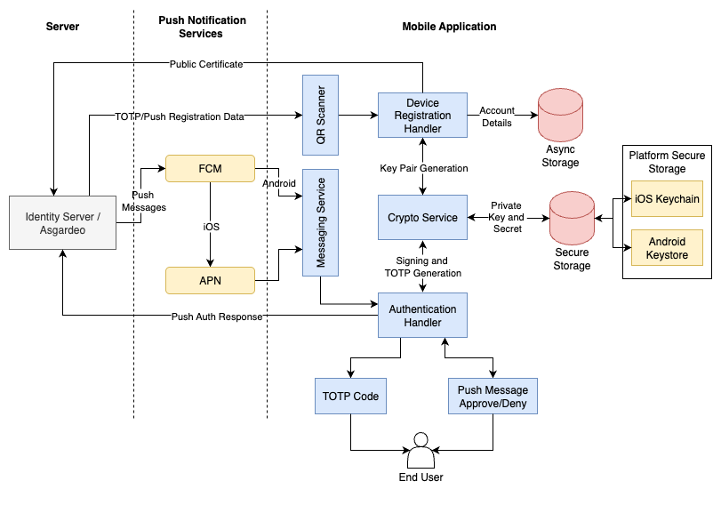

<div align="center">
  
  
  <h1 align="center">Asgardeo Authenticator</h1>
  
  <p align="center">
    <strong>React Native Mobile Application for Multi-Factor Authentication</strong>
  </p>
  
  <p align="center">
    A mobile authenticator application built with React Native and <a href="https://wso2.com/asgardeo/">Asgardeo</a> Identity and Access Management platform that enables TOTP and push notification based authentication on iOS and Android devices.
  </p>

  <p align="center">
    
    
    
    
  </p>

  <p align="center">
    <a href="#-features">Features</a> •
    <a href="#-quick-start">Quick Start</a>
  </p>
</div>

---

## ✨ Features

🔐 **Core Features**
- **Easy Account Setup** - Seamless account registration using in-app QR scanner
- **TOTP Code Generation** - Real-time TOTP generation with next token and expiry time indicator
- **Multi-State Push Notifications** - Push notification delivery across background, foreground, and app quit states
- **Number Challenge Support** - Advanced push authentication with number challenge prompts
- **Push Login History** - Complete tracking and history of all push authentication activities
- **Push Device Unregistration** - Secure device removal and deregistration capabilities

🔒 **Security Features**
- **Secure Secret Storage** - All secrets and private keys stored securely in iOS Keychain and Android Keystore
- **Device Local Authentication** - Biometric and device authentication for app access control
- **Push Authentication Controls** - Secure push approval and denial mechanisms
- **Account Deletion** - Complete account removal with secure data cleanup

## 🚀 Quick Start

Get your Asgardeo Authenticator App up and running in minutes!

> [!IMPORTANT]
> Use physical devices instead of emulators for testing push notifications. Emulators may not properly handle FCM push messages and biometric authentication.

### 🧪 Tested Platform Versions

This application has been tested on the following platform versions:

| Platform | Version | Build Name |
|----------|---------|------------|
| Android  | 16      | Baklava    |
| iOS      | 18.4.1  | -          |

### 📋 Prerequisites

- **Node.js** (version 22 or higher)
- **Expo CLI** (`npm install -g @expo/cli`)
- **Physical iOS/Android device** (recommended for push notifications)
- **Same Network**: Ensure your development machine and mobile device are on the same network

### 🔧 Initial Setup

**Clone and Install Dependencies**

   ```bash
   git clone https://github.com/asgardeo-samples/asgardeo-react-native-samples.git
   cd asgardeo-react-native-samples/authenticator-app
   npm install
   ```

### ⚙️ Configuration

Push notifications are essential for the authenticator app functionality. Complete the following configuration steps before running the application.

#### 🔥 Firebase Cloud Messaging (FCM) Setup

> [!TIP]
> Official Documentation: [Firebase Setup Guide](https://firebase.google.com/docs/cloud-messaging)

##### Step 1: Create Firebase Project

1. Navigate to [Firebase Console](https://console.firebase.google.com/)
2. Click **Add project** or select an existing project
3. Follow the setup wizard to create your project

##### Step 2: Configure Firebase Apps

**For Android:**

1. In Firebase Console, go to **Project Settings** (gear icon)
2. Under **Your apps**, click **Add app** > Select **Android** icon
3. Register your app with package name (e.g., `com.yourcompany.authenticator`)
4. Download the `google-services.json` file
5. Place it in the `./config/` directory of this project

> [!TIP]
> Official Guide: [Add Firebase to Android](https://firebase.google.com/docs/android/setup)

**For iOS:**

1. In Firebase Console, go to **Project Settings**
2. Under **Your apps**, click **Add app** > Select **iOS** icon
3. Register your app with Bundle ID (e.g., `com.yourcompany.authenticator`)
4. Download the `GoogleService-Info.plist` file
5. Place it in the `./config/` directory of this project

> [!TIP]
> Official Guide: [Add Firebase to iOS](https://firebase.google.com/docs/ios/setup)

##### Step 3: Upload APNs Authentication Key to Firebase

For iOS push notifications to work, you need to upload your Apple Push Notification service (APNs) authentication key to Firebase.

1. In Firebase Console, go to **Project Settings** > **Cloud Messaging** tab
2. Scroll to **Apple app configuration** section
3. Upload your **APNs Authentication Key** (.p8 file) - see [Apple Developer Setup](#-apple-developer-account-setup) below
4. Enter your **Key ID** and **Team ID**

> [!TIP]
> Official Guide: [Set up APNs with FCM](https://firebase.google.com/docs/cloud-messaging/ios/certs)

##### Step 4: Configure Asgardeo Push Provider

1. Download the Firebase service account JSON file:
   - In Firebase Console, go to **Project Settings** > **Service accounts**
   - Click **Generate new private key**
   - Download the `service-account.json` file

2. Configure push provider in Asgardeo:
   - Navigate to your Asgardeo organization
   - Add the `service-account.json` to Asgardeo push provider configuration

> [!TIP]
> Official Guide: [Configure Push Provider in Asgardeo](https://wso2.com/asgardeo/docs/guides/notification-channels/configure-push-provider/)

##### Configuration Files Structure

Ensure your `config/` directory has the following structure:

```
config/
├── app.config.json              # App configuration
├── google-services.json         # 🔥 Firebase Android config
├── GoogleService-Info.plist     # 🔥 Firebase iOS config
```

#### 🍎 Apple Developer Account Setup

> [!TIP]
> Official Documentation: [Apple Developer Program](https://developer.apple.com/programs/)

Push notifications on iOS require proper Apple Developer account configuration.

##### Step 1: Create App ID with Push Notifications

1. Sign in to [Apple Developer Portal](https://developer.apple.com/account/)
2. Navigate to **Certificates, Identifiers & Profiles**
3. Click on **Identifiers** > **+** (Add button)
4. Select **App IDs** > **Continue**
5. Select **App** > **Continue**
6. Configure your App ID:
   - **Description**: Enter a description (e.g., "Asgardeo Authenticator")
   - **Bundle ID**: Enter your Bundle ID (e.g., `com.yourcompany.authenticator`)
   - **Capabilities**: Check **Push Notifications**
7. Click **Continue** > **Register**

> [!TIP]
> Official Guide: [Register an App ID](https://developer.apple.com/help/account/manage-identifiers/register-an-app-id/)

##### Step 2: Register Your Device

1. In Apple Developer Portal, go to **Devices**
2. Click **+** (Add button)
3. Enter **Device Name** and **Device UDID**
   - To find UDID: Connect device > Open Finder/iTunes > Click on device > Click on serial number to reveal UDID
4. Click **Continue** > **Register**

> [!TIP]
> Official Guide: [Register a Device](https://developer.apple.com/help/account/register-devices/register-a-single-device/)

##### Step 3: Create Provisioning Profile

1. In Apple Developer Portal, go to **Profiles**
2. Click **+** (Add button)
3. Select **iOS App Development** > **Continue**
4. Select your **App ID** > **Continue**
5. Select your **Certificate** > **Continue**
6. Select your **Devices** > **Continue**
7. Enter **Provisioning Profile Name** > **Generate**
8. **Download** the provisioning profile (`.mobileprovision` file)
9. **Install** the provisioning profile on your Mac:
   - Double-click the downloaded `.mobileprovision` file, or
   - Drag and drop it into Xcode.

> [!TIP]
> Official Guide: [Create a Provisioning Profile](https://developer.apple.com/help/account/provisioning-profiles/create-a-development-provisioning-profile)

##### Step 4: Generate APNs Authentication Key

This key is needed for Firebase Cloud Messaging to send push notifications to iOS devices.

1. In Apple Developer Portal, go to **Keys**
2. Click **+** (Add button)
3. Enter **Key Name** (e.g., "FCM Push Notifications")
4. Check **Apple Push Notifications service (APNs)**
5. Click **Continue** > **Register**
6. **Download** the `.p8` key file (you can only download it once!)
7. Note down the **Key ID** and **Team ID** (found in top-right corner)

> [!TIP]
> Official Guide: [Create APNs Authentication Key](https://developer.apple.com/help/account/keys/create-a-private-key)

##### Step 5: Upload APNs Key to Firebase

1. Go back to [Firebase Console](#step-4-upload-apns-authentication-key-to-firebase)
2. Upload the `.p8` file along with **Key ID** and **Team ID**

> [!IMPORTANT]
> Keep your `.p8` file secure! You cannot download it again from Apple Developer Portal.

### ▶️ Run on Device

Before running the app on your device, update the bundle identifiers to match your Firebase and Apple Developer configurations.

#### 📝 Update Bundle ID

Edit the `app.json` file in the project root and update the following:

```json
{
  "expo": {
    ...
    "ios": {
      ...
      "bundleIdentifier": "com.yourcompany.authenticator"
      ...
    },
    "android": {
      ...
      "package": "com.yourcompany.authenticator"
      ...
    }
    ...
  }
}
```

> [!IMPORTANT]
> - The **iOS bundleIdentifier** must match the Bundle ID you configured in [Apple Developer Portal](#step-1-create-app-id-with-push-notifications)
> - The **Android package** must match the package name you configured in [Firebase Console](#step-2-configure-firebase-apps)

#### 🤖 Android Device Setup

> [!TIP]
> Follow the [Expo Android Device Setup Guide](https://docs.expo.dev/get-started/set-up-your-environment/?mode=development-build&buildEnv=local&platform=android) for detailed instructions on setting up your Android device for development.

**Quick Start:**
```bash
# Run the application on your Android device
npx expo run:android
```

#### 🍎 iOS Device Setup

> [!TIP]
> Follow the [Expo iOS Device Setup Guide](https://docs.expo.dev/get-started/set-up-your-environment/?mode=development-build&buildEnv=local&platform=ios&device=physical) for detailed instructions on setting up your iOS device for development.

**Quick Start:**
```bash
# Run the application on your iOS device
npx expo run:ios --device
```

---

## 🏗️ Architecture



- **Cross-platform application**: A React Native mobile application to support both push-based authentication and TOTP authentication.
- **Ease of use**: Users can install the application on their mobile devices and use it without sign in.
- **Device registration**: For both push authentication and TOTP, users can scan a QR code to register their device for authentication.
- **Secure storage for push authentication**:
   - A key pair is generated on the mobile application.
   - The private key is securely stored in the iOS Keychain and Android Keystore.
   - The public key is transmitted to Asgardeo for push authentication signature verification.
- **Data storage**: Account details, device ID, TOTP period, and user/organization details will be stored in React Native Async Storage (key-value pair storage).
- **Push notifications**:
   - Firebase Cloud Messaging (FCM) is used to deliver push notifications to both iOS and Android devices.
   - On Android, FCM delivers notifications directly.
   - On iOS, Apple Push Notification (APN) Service will be integrated with FCM to deliver notifications.

For more details, refer to the [codebase](./docs/CODE.md) and [configuration](./docs/CONFIGURATION.md).
